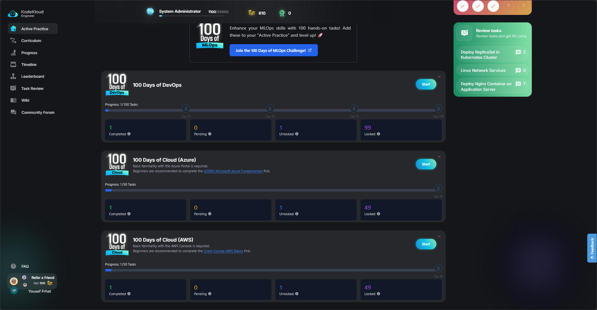

بسم الله اللذي لا يضر مع اسمه شئ في الارض ولا في السماء وهو السميع العليم 

## About This Repository

This is my attempt to stay consistent with learning and keep sharpening my cloud and 
DevOps skills through daily hands-on practice. I've touched these areas before, but I 
believe the only way to really keep up is to keep doing — solving real tasks, hitting 
real errors, and figuring them out.

Every day here has its own entry: the task I was given, the commands I used, why I used 
them, and any issues I ran into. It's less about finishing 100 days and more about having 
a real, honest record of the process.

